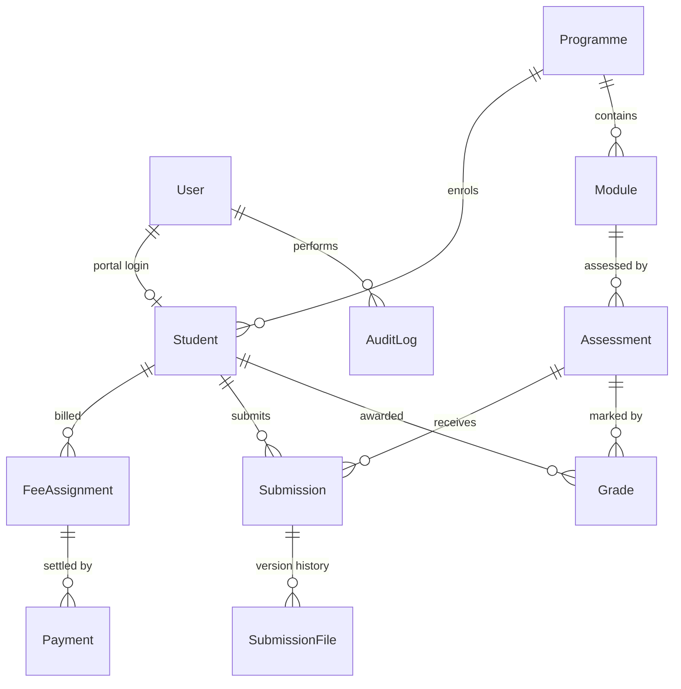

# Student Management System — Registry Module

A working Registry back office for a small institution: enrol students, bill and reconcile fees,
collect assessment submissions, and mark and release results. Built for the PEN Global technical
assessment.

**Stack:** Next.js 16 (App Router) · PostgreSQL 16 · Prisma 7 · TypeScript · Tailwind v4 ·
shadcn/ui · Zod · Vitest

---

## Quick start

Requires Node 20.9+ and Docker.

```bash
git clone <this-repo> && cd student-management-system
npm install                # runs `prisma generate` automatically

cp .env.example .env       # the defaults match docker-compose.yml and work as-is

npm run db:up              # starts PostgreSQL 16 on localhost:5433
npm run db:migrate         # applies migrations
npm run db:seed            # loads the demo data described below

npm run dev                # http://localhost:3000
```

`npm run db:reset` drops, re-migrates and re-seeds if you want a clean slate.

### Demo accounts

| Role | Email | Password | What to look at |
|---|---|---|---|
| Registry staff | `registry@sms.ac.uk` | `Registry123!` | Dashboard, arrears, marksheets |
| Registry staff | `tutor@sms.ac.uk` | `Registry123!` | Same access — a second staff account |
| Student (paid up) | `amara.okafor@students.sms.ac.uk` | `Student123!` | Clean account, published results |
| Student (in arrears) | `chloe.martins@students.sms.ac.uk` | `Student123!` | Overdue balance, **result withheld** |
| Student (late work) | `ben.whitfield@students.sms.ac.uk` | `Student123!` | Late submission flag, part-paid fee |

Every student in the seed uses `Student123!`.

### Environment variables

| Variable | Required | Purpose |
|---|---|---|
| `DATABASE_URL` | yes | PostgreSQL connection string. Prisma 7 reads it via `prisma.config.ts` for the CLI and passes it to the driver adapter at runtime. |
| `AUTH_SECRET` | yes | HMAC key for signing session JWTs. Minimum 32 characters — generate with `openssl rand -base64 32`. |
| `UPLOAD_DIR` | no | Where submitted files are written. Defaults to `storage/submissions`, resolved from the project root. |

`.env` is gitignored; `.env.example` is committed. No credentials are in the repository.

### Checks

```bash
npm test          # 60 unit tests over the domain rules
npm run typecheck # tsc --noEmit
npm run build     # production build
```

---

## What was built

### 1. Student enrolment
Create a student with full name, email, date of birth, programme, academic session and status.
Registry IDs (`SMS-2026-0001`) are allocated automatically per intake year. The register supports
free-text search across name, registry ID and email, ANDed with programme, status and fee-state
filters, with server-side pagination. Filter state lives in the URL so a filtered view can be
bookmarked or sent to a colleague.

### 2. Fees & payments
Fees default to the programme rate but can be overridden with a recorded justification. Payments
capture amount, date, reference and method. Outstanding balance is derived from the ledger on every
read. Overdue accounts are flagged on the dashboard, sorted by age, and available as a filter on the
register.

### 3. Assessment submission
Staff create assessments against a module with a deadline and weighting. Students upload PDF or
DOCX (10 MB limit) against assessments on their own programme. One submission row per student per
assessment; replacing work before the deadline versions it and keeps the earlier file. Late work is
accepted and permanently flagged.

### 4. Marksheet & results
Staff enter a 0–100 mark or record a student absent. Classification is computed on write
(Pass ≥ 40, Merit ≥ 60, Distinction ≥ 70; below 40 is a Fail). Results are staff-only until
explicitly released, per student or in bulk per assessment. Students see only released results.

---

## Product decisions and edge cases

This is the part I would want to talk through in an interview. Each rule below is enforced in the
service layer, so it holds identically through the UI and the REST API.

### Enrolment

**Registry IDs are allocated with one atomic statement, not `count() + 1`.** Two administrators
enrolling at the same moment would otherwise read the same count and mint the same ID. A
`StudentIdCounter` row per intake year is incremented with
`INSERT … ON CONFLICT DO UPDATE … RETURNING`, inside the same transaction as the insert. Verified by
firing five concurrent enrolments and asserting five distinct IDs.

**Withdrawn and completed are terminal statuses.** A student who withdraws and returns next year
gets a *new* enrolment record. Reopening the old one would erase the fact that they left — which is
exactly the fact Registry gets audited on. Withdrawal and deferral both require a written reason.

**Emails are normalised to lowercase and unique.** `A@x.ac.uk` cannot shadow `a@x.ac.uk`. A
duplicate returns a 409 naming the registry ID that already holds it, not a 500 from the database.

**Dates of birth are sanity-checked** (must be past, implying an age of 15–100) — a typo'd century
is the most common data-entry error on this form.

### Fees

**Balances are derived, never stored.** A denormalised balance column is the classic source of "the
system says she owes £0 but finance says £450". Money is `Decimal(12,2)` end to end — there is a
test asserting that 0.10 + 0.20 settles a 0.30 fee exactly, which floats would not.

**Overpayment is refused, not absorbed.** Taking more than is owed would create a silent negative
balance and misreport income. Refunds and credit notes are a separate finance process, so the API
returns 422 with the actual outstanding figure rather than inventing a credit.

**Payment references are globally unique.** Keying the same bank reference twice is the classic
double-entry mistake, and it clears a balance that was only paid once. The second attempt gets a
409. Payments are never edited or deleted — corrections are new records.

**A fee due today is not overdue.** Overdue means *past* the due date with money outstanding.
Comparison is on whole local days so "3 days overdue" means the same thing at 09:00 and at 17:00.

**Withdrawn students stay on the arrears report.** They still owe what they were billed before they
left — they simply cannot be billed anything *new*. Getting this backwards either writes off real
debt or bills people who have gone.

**Programme fee changes never rewrite existing bills.** The amount is copied onto the fee line at
assignment time. Overriding the standard rate requires a note, which is stored on the fee and in
the audit log.

### Submissions

**File type is verified by magic bytes, not by what the browser claims.** A renamed executable
sends `Content-Type: application/pdf` quite happily. Extension, MIME type and the leading bytes
(`%PDF`, `PK\x03\x04`) must all agree.

**Submitting exactly on the deadline is on time**; one millisecond later is late. Lateness is
computed once and frozen on the record — recomputing it later would silently absolve late work if a
registrar ever extended the deadline.

**Late work is accepted, flagged, and then locked.** The brief allows resubmission *before* the
deadline, so a first submission after the deadline is accepted and marked late, but it cannot then
be swapped repeatedly — otherwise "late" would stop meaning anything. The student gets a message
pointing them at Registry rather than a silent failure.

**Superseded versions are kept.** When a student replaces a draft, the earlier file stays in
`SubmissionFile` so "what did they actually have in by the deadline?" is answerable.

**Files are never served from `/public`.** They are written outside the web root under a generated
UUID, and `/api/files/:id` checks the session before streaming: staff read anything, a student only
their own work. Verified by requesting another student's file and getting a 403.

### Results

**Absent is not a mark of zero.** Both fail, but boards treat them differently — a zero was
attempted, an absence was not. `score` is nullable with a separate `isAbsent` flag.

**Results in arrears are held back by default.** This is real Registry practice, so it is enforced
rather than left to the operator's memory: publishing for a student with an overdue balance returns
422 with the amount owed. Staff can override it deliberately — there are legitimate exceptions,
hardship cases and disputed invoices — and the override is recorded in the audit log. Bulk
publishing skips those students, marks them "withheld pending fee settlement", and reports exactly
who was held back and why.

**Amending a published mark unpublishes it.** A result a student has already seen should not change
under their feet; the amended mark goes back into the staff queue for re-release.

**Unpublished marks never leave the server.** The student marksheet query selects only
`published: true` rows — the score is not fetched and hidden in the UI, it is not fetched at all.
Confirmed by inspecting the raw API payload for a student with a withheld result.

### Access control

`proxy.ts` (Next 16's renamed middleware) redirects browsers to the right area, but it is **not**
the security boundary. Server Actions are reachable by direct POST, so `requireStaff()` /
`requireStudent()` run inside every action and route handler, and student-scoped queries filter on
the session's own student ID rather than trusting a parameter.

---

## Architecture

```
src/
  app/
    login/                  credentials sign-in (Server Action)
    staff/                  dashboard · students · fees · assessments · programmes
    student/                overview · fees · assessments (upload) · results
    api/                    REST handlers — see the table below
  components/               shell, badges, shadcn/ui primitives
  lib/
    domain/                 pure, unit-tested rules (no I/O)
      balance.ts            outstanding / overdue arithmetic
      classification.ts     mark → classification bands
      status-machine.ts     legal enrolment transitions
      submission-rules.ts   late detection, file sniffing, resubmission
      student-id.ts         registry ID and academic-session formats
    services/               orchestration: DB + rules + audit
    validation/schemas.ts   Zod schemas shared by forms and API
    auth/                   bcrypt hashing, JWT session, role guards
  proxy.ts                  optimistic routing guard
prisma/schema.prisma        data model
prisma/seed.ts              demo data
tests/                      60 unit tests over src/lib/domain
```

The UI mutates through **Server Actions**; the REST handlers call the **same service functions**.
Business rules are written once, so `POST /api/payments` and the payment dialog reject an
overpayment for the same reason with the same message.

Errors use one vocabulary (`AppError` with a code) mapped to HTTP: validation → 400, rule violation
→ 422, unauthorised → 401, forbidden → 403, not found → 404, conflict → 409. Unexpected failures
are logged server-side and returned as a generic 500.

### Data model



`StudentIdCounter` (one row per intake year) backs atomic ID allocation. `AuditLog` records status
changes, fee overrides, payments, publications and arrears overrides.

### API

All endpoints require the session cookie from `POST /api/auth/login`.

| Method | Path | Notes |
|---|---|---|
| `POST` | `/api/auth/login` · `/api/auth/logout` | Sets/clears the session cookie |
| `GET` `POST` | `/api/students` | List with `q`, `programmeId`, `status`, `arrears`, `page`, `sort`; create (staff) |
| `GET` `PATCH` `PUT` | `/api/students/:id` | Accepts the internal id or `SMS-…`; `PUT` changes status |
| `GET` | `/api/programmes` | Programmes, modules, standard fees |
| `GET` `POST` | `/api/fees` | Fee register; raise a fee |
| `GET` `POST` | `/api/payments` | Ledger; record a payment |
| `GET` `POST` | `/api/assessments` | Students get their own programme's, with unpublished marks stripped |
| `GET` `POST` | `/api/assessments/:id/submissions` | Staff list; student multipart upload |
| `GET` `PUT` | `/api/grades` | Students always get their published marksheet only |
| `POST` | `/api/grades/publish` | Single (`gradeId`) or bulk (`assessmentId`); `overrideArrearsHold` |
| `GET` | `/api/files/:id` | Authorised download |
| `GET` | `/api/dashboard` | Dashboard figures |

```bash
# Try it
curl -s -c jar -X POST localhost:3000/api/auth/login \
  -H 'Content-Type: application/json' \
  -d '{"email":"registry@sms.ac.uk","password":"Registry123!"}'

curl -s -b jar 'localhost:3000/api/students?arrears=overdue'
```

### Seed data

2 programmes, 5 modules, 8 students, 9 fee lines, 7 payments, 4 assessments, 7 submissions and 8
grades — chosen so every edge case above is visible without creating anything:

- fees: fully paid · part paid and overdue · unpaid and overdue · part paid but not yet due · not yet due
- statuses: enrolled, deferred (with reason), withdrawn **owing money**, completed
- submissions: on time · 2 days late · resubmitted (v2, v1 retained) · never submitted
- results: all four bands, one absence, some published, **one withheld for arrears**

---

## How I used AI

I used Claude (Claude Code) throughout, as an accelerator on the parts I already knew the shape of
and as a reviewer on the parts I did not. What I did *not* do is accept its first answer as the
design.

**Where it helped most**

- *Checking my assumptions about the stack before writing anything.* I had it read the Next.js 16
  and Prisma 7 release notes rather than working from memory. That surfaced three things which would
  otherwise have cost me an afternoon: `middleware.ts` is now `proxy.ts`, Prisma 7 requires a driver
  adapter and moves seed config into `prisma.config.ts`, and `datasource.url` is no longer allowed
  in the schema file.
- *Scaffolding.* The Prisma schema, the shadcn/ui page shells, the seed script and the repetitive
  route-handler bodies were largely generated from a written spec of the rules, then edited.
- *Adversarial review.* Once the rules were written I asked it to argue against them — "what would a
  registrar complain about here?" The arrears-hold-on-publication rule and keeping withdrawn
  students on the arrears report both came out of that. So did the point that an absence is not a
  zero.
- *Test case generation.* I specified the boundaries that mattered (39/40, 59/60, 69/70, deadline
  ±1 ms, due-date-today) and had it write the table-driven tests.

**Where I overrode it**

- It proposed NextAuth. On Next 16 the stable release is v4 (Pages-Router era) and v5 is a beta
  needing a forced peer-dependency override, so I hand-rolled credentials auth with `bcryptjs` and
  `jose` — about 120 lines, no beta dependencies, and something I can explain line by line.
- Its first schema stored `balance` on the student. I replaced it with derived balances; a stored
  balance drifts from the ledger the first time anything is inserted out of band.
- It generated the student-ID allocator as `count() + 1`. I replaced it with an atomic
  `INSERT … ON CONFLICT … RETURNING` and wrote the concurrency check that proves it.
- It suggested serving uploads from `/public` for simplicity. That makes every submission publicly
  guessable, so files go outside the web root behind an authorising route.
- It initially imported `Prisma.Decimal` into a module that Client Components use, which broke the
  production build. I moved the money helpers onto `decimal.js` so the domain layer is
  bundler-neutral.

**How I verified it**

Nothing here is "it compiled, ship it". I drove the running app with curl end to end and checked the
actual responses: concurrent enrolment produces unique IDs; a duplicate email is a 409; overpayment
is a 422; an executable renamed `.pdf` is rejected; a post-deadline first submission is 201 with
`isLate: true` and a second one is a 422; a student cannot read another student's record or download
their file; a withheld result is absent from the student's API payload entirely. The domain rules
are covered by 60 unit tests.

---

## Known limitations

Scoped out deliberately for a time-boxed exercise, in rough priority order:

- **No refunds or credit notes.** Overpayment is refused rather than modelled. A real system needs a
  credit note type and a negative-adjustment flow.
- **Local disk storage.** Fine for a single node; production would need S3 or similar, plus virus
  scanning on upload.
- **No per-module enrolment.** A student is assessed on any module in their programme; real
  registries track module registration, which is what would drive resit eligibility.
- **No transcript or award calculation.** Individual assessment results only — no credit-weighted
  module marks or final classification.
- **No email.** Publishing a result or flagging arrears should notify the student.
- **The audit log is append-only but not tamper-evident**, and there is no UI to browse it beyond
  the last few entries on a student record.
- **Tests cover the domain layer.** Service-layer integration tests against a throwaway database
  would be the next addition; the API behaviours listed above were verified manually rather than in
  CI.
